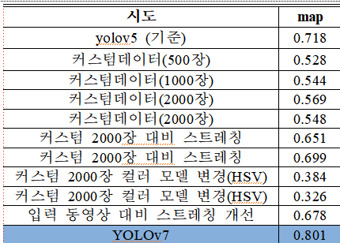
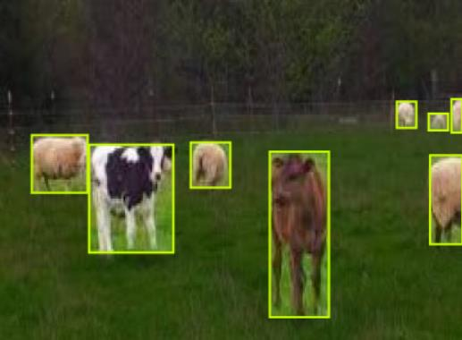

# CowDetect - 2022 캡스톤 디자인  은상 수상

4조 졸업 프로젝트 

yolov7와 deepsort기반 젖소 객체추적프로젝트입니다. 젖소의 활동량을 계산하여 발정기 및 가임기를 예측하는것이 목표입니다. 


</br>
## yolov7의 성능 향상을 위한 시도들

</br>
</br>
직접 사용가능한 젖소이미지와 목장 이미지를 찾아 데이터를 수집하였습니다. </br>모은데이터를 [로보플로우](https://roboflow.com) 에 업로드하여 직접 데이터라벨링을 진행하였습니다.

## 데이터 전처리
- 대비스트레칭
- HSV변환
- 회전과 반전으로 데이터 증강

### 로보플로우로 라벨링한 데이터 예시


## 훈련 방법
- yolo에서 제공하는 사전학습된 모델 가중치를 프리징하여 일부 레이어만 훈련시키는 방법
  - 마지막레이어를 제외한 모든 레이어를 프리징 후 훈련
  - 모델의 헤드만 프리징하여 훈련
- 모든 레이어를 훈련시키는방법

* * *

# install 
```
git clone https://github.com/Jang-jiwon/CowDetect.git
cd CowDetect
git submodule update --init --recursive
cd StrongSORT-YOLO
pip install -r requirements.txt
wget https://www.dropbox.com/s/x4x6fr88lbgb504/sample_video.mp4
wget https://github.com/WongKinYiu/yolov7/releases/download/v0.1/yolov7-e6e_training.pt -O /content/CowDetect/StrongSORT-YOLO/yolov7/yolov7-e6e_training.pt
```

# train
프리징 할 경우

```
$python train.py --workers 8 --device 0 --freeze 105 --batch-size 32 --data ../your_path/data.yaml --img 416 416 --cfg cfg/training/yolov7.yaml --weights 'yolov7_training.pt' --name yolov7-custom --hyp data/hyp.scratch.custom.yaml
```
안할 경우
```
$python train.py --workers 8 --device 0 --batch-size 32 --data ../your_path/data.yaml --img 416 416 --weights 'yolov7_training.pt' --name yolov7-custom 
```


# tracking
```
$python track_v7.py --source sample_video.mp4 --save-vid --class 19 --yolo-weights ../your_path/yolov7-e6e_training.pt
```
</br></br></br></br>
[코랩으로 실행하기](train+tracking.ipynb)


[커스텀데이터로 훈련하는 방법](https://github.com/ultralytics/yolov5/wiki/Train-Custom-Data)
